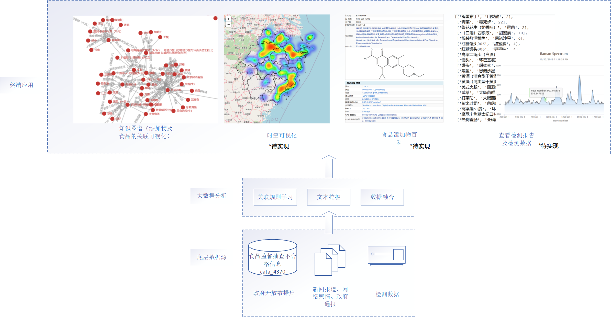
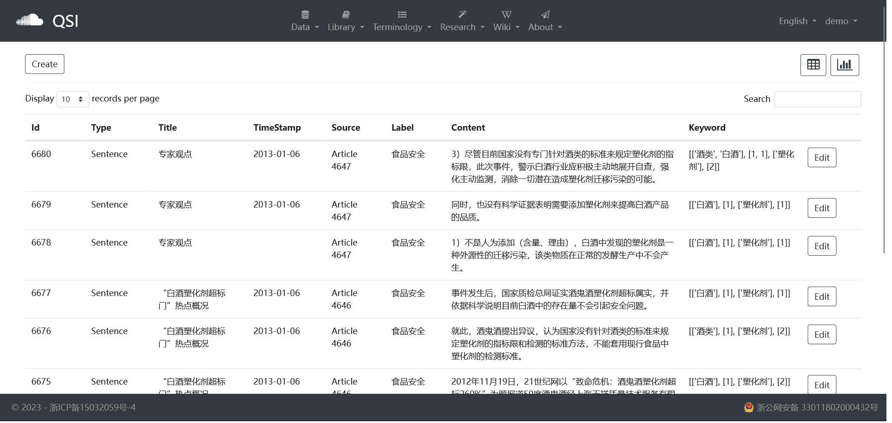
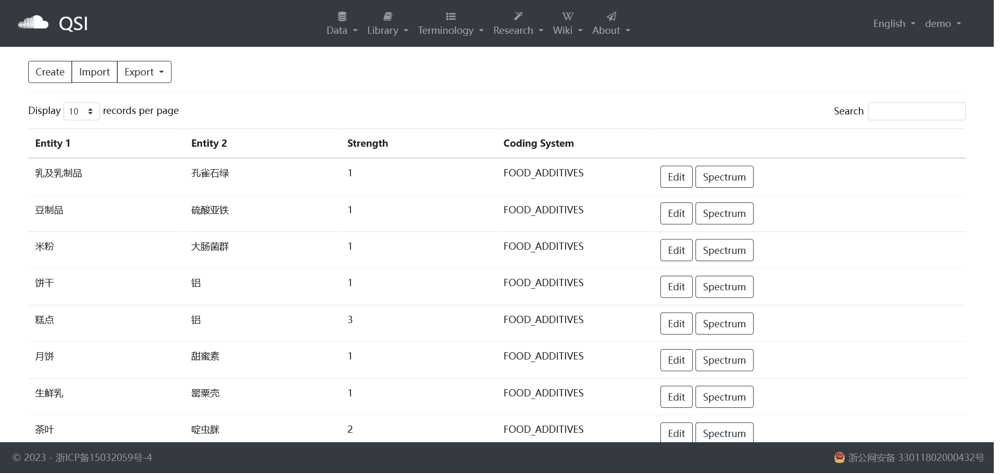

# 案例研究：食品添加剂

聚焦食品中有害化学物质的检验，包括农残、抗生素、霉菌毒素、食品添加剂等。
通过实时文本挖掘构建食品和有害化学物的知识图谱，并基于Force-directed graph提供交互式可视化。

程序：Main.ipynb  
词典构建：Dictionary Construcction.ipynb  
爬虫：Web Crawler.ipynb   
相关材料：/case_study/food_additive/  数据整合了2018年和2023两次的爬虫结果。  
文本分类（判定抓取的文本是否食品安全主题相关）：Text Classification.ipynb  TODO: try BERT finetuned model   
语义关系提取：http://spacs.brahma.pub/association/   
可视化：http://spacs.brahma.pub/v/force/ 

Contributions：  
一个自动定时更新的食品添加剂主题语料库；

结构化的食品添加剂知识图谱管理系统；

基于Force-directed graph的交互式可视化工具。

可重现的Code Ocean Capsule:  
[10.24433/CO.4102110.v1](https://doi.org/10.24433/CO.4102110.v1)